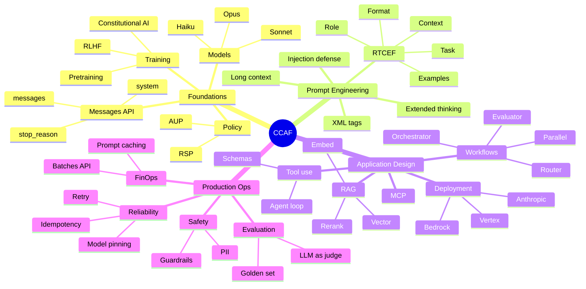
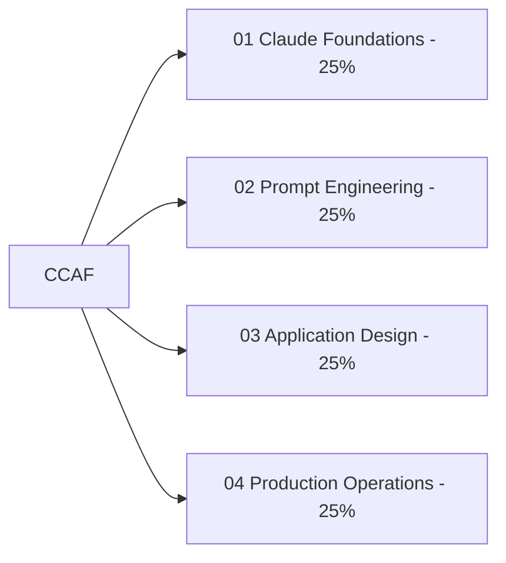
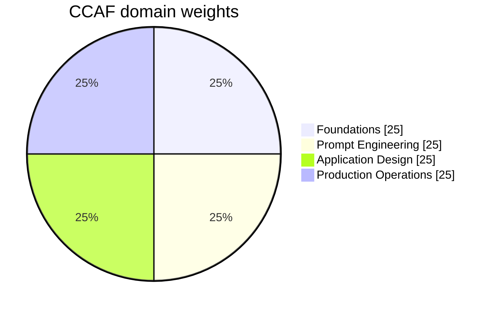

# CCAF Visual Study Guide - Master Index

> Claude Certified Foundation Architect. Concept-only. ASCII content.

## Domain map

## Weighting

## Study plan (suggested)

| Week | Focus | Pages |
|---|---|---|
| 1 | Foundations + API basics | 01, 05, 07 |
| 2 | Prompt engineering deep dive | 02, 13, 14 |
| 3 | RAG, tools, agents, MCP | 03, 09, 16 |
| 4 | Production, eval, ops, policy | 04, 06, 08, 11 |
| 5 | Hands-on labs + flashcards + quiz | 15, 13, 17 |

## How to use this guide

1. Read each domain page once.
2. Click links in the diagrams - they deep-link to Anthropic docs.
3. Run the labs in `15-hands-on-labs.md`.
4. Drill with `13-flashcards.md`.
5. Self-quiz via `17-copilot-quiz.md`.
