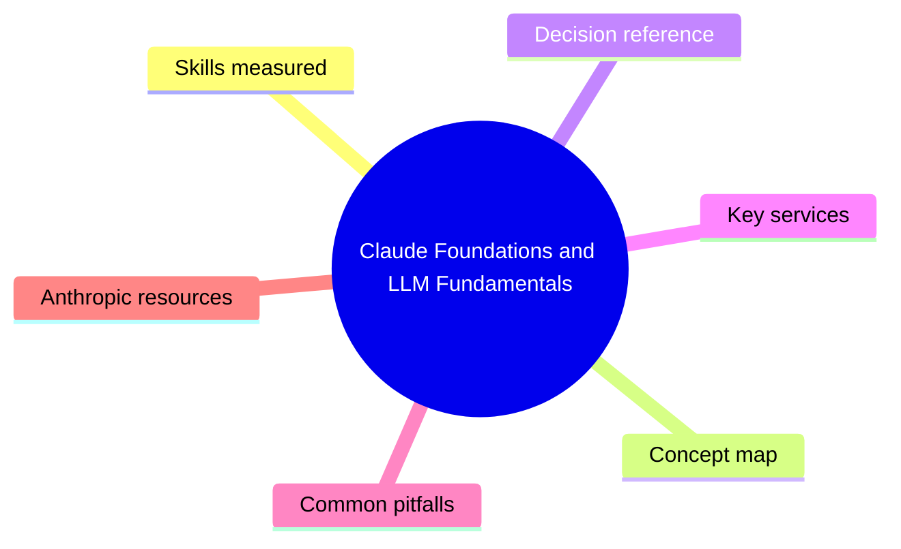
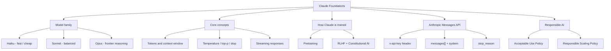

# Claude Foundations and LLM Fundamentals

> Domain 1 of CCAF. Weight: 25%.

## Domain mind map

## Skills measured

- Explain how transformer-based LLMs (Claude family) generate tokens, context windows, attention.
- Compare the Claude model tiers (Haiku, Sonnet, Opus) on speed, cost, quality, and context size.
- Identify when to use Claude vs. classical ML, retrieval, or rules.
- Understand pretraining vs. instruction tuning vs. RLHF / Constitutional AI.
- Apply Anthropic's Responsible Scaling Policy and Acceptable Use Policy at design time.
- Read the Anthropic API: endpoints, authentication, streaming, stop reasons.
- Estimate token usage, latency, and per-call cost for a given workload.

## Concept map

## Decision reference

| When you see... | Pick... | Why |
|---|---|---|
| Latency-critical chat, simple Q and A | Claude Haiku | Cheapest, fastest tier with broad capability. |
| Mainstream production workloads | Claude Sonnet | Best price / performance, default choice. |
| Complex agentic reasoning, long synthesis | Claude Opus | Highest quality on hard reasoning tasks. |
| Very long documents (200K+ tokens) | Any current Claude | All current tiers support large context; pick by quality. |
| Strict regulated content | Add system prompt + filtering | Foundation model alone is not a compliance control. |
| Deterministic structured output | Temperature 0 + JSON-mode prompt | Reduces drift; pair with schema validation. |

## Key services

- **Anthropic API (Messages):** POST /v1/messages with `system`, `messages[]`, `max_tokens`. Returns assistant message and `stop_reason` (end_turn, max_tokens, stop_sequence, tool_use).
- **Claude on Amazon Bedrock:** invoke via Bedrock runtime; same model logic, AWS IAM auth, regional endpoints.
- **Claude on Google Vertex AI:** publisher model on Vertex; GCP service-account auth.
- **Workbench / Console:** Anthropic Console for prompt iteration, prompt library, eval tools, and usage dashboards.
- **Token counter:** `client.messages.count_tokens(...)` to budget before sending.

## Common pitfalls

- Treating context window as "memory" - it is per-call input; persistence is your app's job.
- Forgetting that `system` prompt is separate from `messages[]` (not a role inside the array).
- Setting `max_tokens` too low and getting truncated JSON with `stop_reason: max_tokens`.
- Ignoring `stop_reason` so the app never notices a tool-use turn.
- Assuming Bedrock / Vertex pricing matches Anthropic direct - it does not.

## Anthropic resources

- Anthropic docs: https://docs.anthropic.com/
- Model cards: https://docs.anthropic.com/en/docs/about-claude/models
- Acceptable Use Policy: https://www.anthropic.com/legal/aup
- Responsible Scaling Policy: https://www.anthropic.com/responsible-scaling-policy
