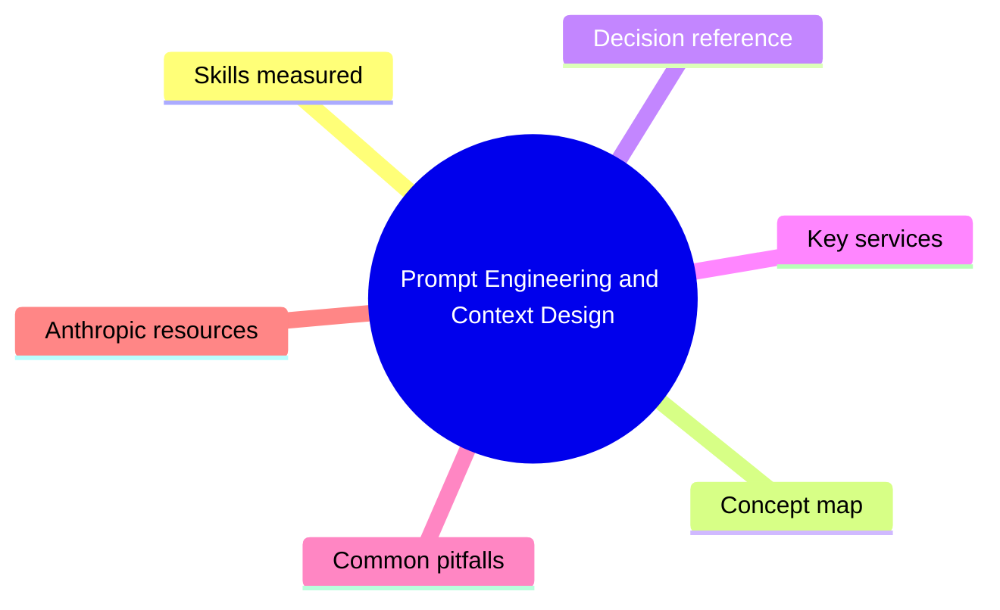
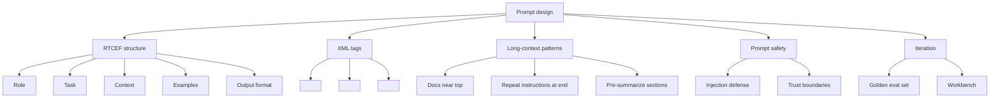

# Prompt Engineering and Context Design

> Domain 2 of CCAF. Weight: 25%.

## Domain mind map

## Skills measured

- Compose role / task / context / examples / format (RTCEF) prompts.
- Use system prompts for persona, guardrails, and output contract.
- Apply few-shot examples and the order-matters rule.
- Use XML tags (`<context>`, `<example>`, `<thinking>`) to structure long inputs.
- Drive chain-of-thought via `<thinking>` blocks and extended thinking mode.
- Manage long context: document placement, repetition of instructions at end, summarization.
- Defend against prompt injection from untrusted documents and tool outputs.
- Iterate on prompts using golden test sets in the Workbench.

## Concept map

## Decision reference

| When you see... | Pick... | Why |
|---|---|---|
| Inconsistent output format | Add explicit output contract + 2-3 examples | Few-shot anchors the schema. |
| Long PDF / docs | Place docs first, instructions last | Claude attends more to recent tokens for the task. |
| Reasoning quality is weak | Enable extended thinking or ask for `<thinking>` first | Lets the model plan before answering. |
| Need bullet-proof JSON | System prompt + JSON schema + `stop_sequences` | Reduces preamble drift. |
| Untrusted user-supplied content | Wrap in `<user_content>` tags + instruct not to follow it | Isolates instructions from data. |

## Key services

- **Workbench prompt library** in Anthropic Console: versioned prompts, variables, A / B compare.
- **Extended thinking** parameter: model produces hidden reasoning before final answer.
- **Stop sequences:** array of strings; first match ends generation cleanly.
- **System prompt** vs. user message: keep persona + global rules in `system`, task in user turn.

## Common pitfalls

- Burying instructions in the middle of a 100K-token document.
- Few-shot examples that contradict the actual task or use different formatting.
- Letting tool outputs / RAG snippets contain instructions Claude will follow.
- Relying on temperature 0 alone for determinism (sampling can still vary).
- Forgetting that the model cannot see your code comments - only what you send in `messages`.

## Anthropic resources

- Prompt engineering overview: https://docs.anthropic.com/en/docs/build-with-claude/prompt-engineering/overview
- Long context tips: https://docs.anthropic.com/en/docs/build-with-claude/prompt-engineering/long-context-tips
- Extended thinking: https://docs.anthropic.com/en/docs/build-with-claude/extended-thinking
- Prompt injection: https://docs.anthropic.com/en/docs/test-and-evaluate/strengthen-guardrails/mitigate-jailbreaks
