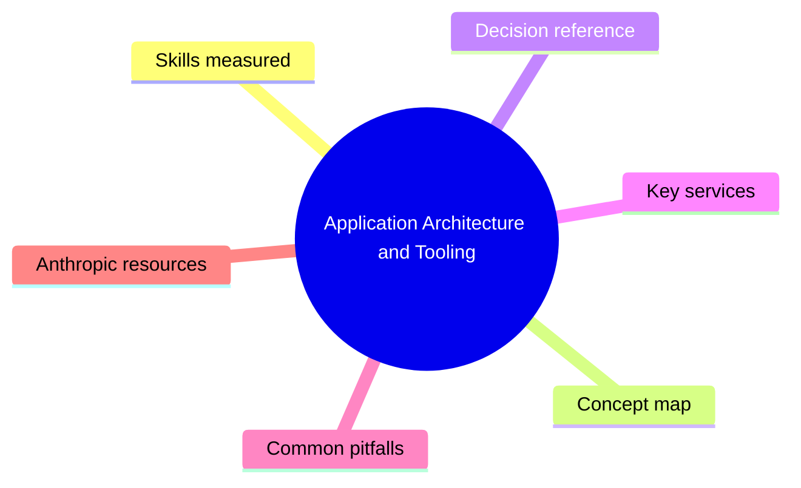

# Application Architecture and Tooling

> Domain 3 of CCAF. Weight: 25%.

## Domain mind map

## Skills measured

- Design retrieval-augmented generation (RAG) with chunking, embeddings, vector store, reranking.
- Use Claude tool use (function calling) with `tools[]` and `tool_choice`.
- Build agents with loops, tool registries, and termination conditions.
- Integrate the Model Context Protocol (MCP) for portable tool servers.
- Compose multi-step workflows (router, parallel, evaluator-optimizer, orchestrator-workers).
- Stream responses with server-sent events for interactive UX.
- Pick deployment: Anthropic direct, AWS Bedrock, GCP Vertex AI.

## Concept map

```mermaid
flowchart TD
    Root["Claude app architecture"]
    Root --> RAG["RAG"]
    RAG --> Chunk["Chunk + embed"]
    RAG --> Vector["Vector store"]
    RAG --> Rerank["Rerank"]
    RAG --> Inject["Inject into prompt"]
    Root --> Tools["Tool use"]
    Tools --> Schema["JSON schema tools"]
    Tools --> Choice["tool_choice"]
    Tools --> Loop["Agent loop"]
    Root --> MCP["Model Context Protocol"]
    MCP --> Servers["MCP servers"]
    MCP --> Clients["MCP clients"]
    Root --> Patterns["Workflow patterns"]
    Patterns --> Router["Router"]
    Patterns --> Parallel["Parallel fan-out"]
    Patterns --> Eval["Evaluator-optimizer"]
    Patterns --> Orch["Orchestrator-workers"]
    Root --> Deploy["Deployment surfaces"]
    Deploy --> Direct["Anthropic API"]
    Deploy --> Bedrock["AWS Bedrock"]
    Deploy --> Vertex["GCP Vertex AI"]
```

## Decision reference

| When you see... | Pick... | Why |
|---|---|---|
| App needs fresh, proprietary knowledge | RAG with vector store | Cheaper and fresher than fine-tuning. |
| App must take actions in other systems | Tool use + agent loop | Lets Claude call typed functions. |
| Reuse the same tools across many apps | MCP server | Tool definitions live once, many clients consume. |
| Variable task type per request | Router workflow | One LLM call classifies, downstream specialists handle. |
| Large doc must be processed end-to-end | Orchestrator-workers | Plan steps, fan out, reassemble. |
| Already on AWS, IAM-everything | Bedrock | Native IAM, VPC, CloudTrail. |
| Already on GCP, Vertex pipelines | Vertex AI | Native IAM, regional, model garden. |

## Key services

- **Tool use API:** define `tools: [{ name, description, input_schema }]`; loop on `tool_use` -> execute -> `tool_result`.
- **MCP:** open spec by Anthropic. Servers expose tools / resources / prompts over stdio or HTTP.
- **Embeddings:** Anthropic recommends Voyage AI embeddings (`voyage-3` family) for Claude RAG.
- **Vector stores:** pgvector, Pinecone, Weaviate, Qdrant, Chroma, OpenSearch.
- **Streaming:** `stream: true` returns SSE with `message_start`, `content_block_delta`, `message_stop`.

## Common pitfalls

- Recursive tool loops with no max-iterations guard.
- RAG retrieving chunks that contain prompt-injection payloads.
- Embedding once, never re-embedding when source docs change.
- Tool schemas that are too loose (model invents fields).
- Forgetting to feed `tool_result` back into the next `messages` turn.

## Anthropic resources

- Tool use: https://docs.anthropic.com/en/docs/build-with-claude/tool-use
- Building effective agents: https://www.anthropic.com/engineering/building-effective-agents
- Model Context Protocol: https://modelcontextprotocol.io/
- Bedrock guide: https://docs.anthropic.com/en/api/claude-on-amazon-bedrock
- Vertex guide: https://docs.anthropic.com/en/api/claude-on-vertex-ai
