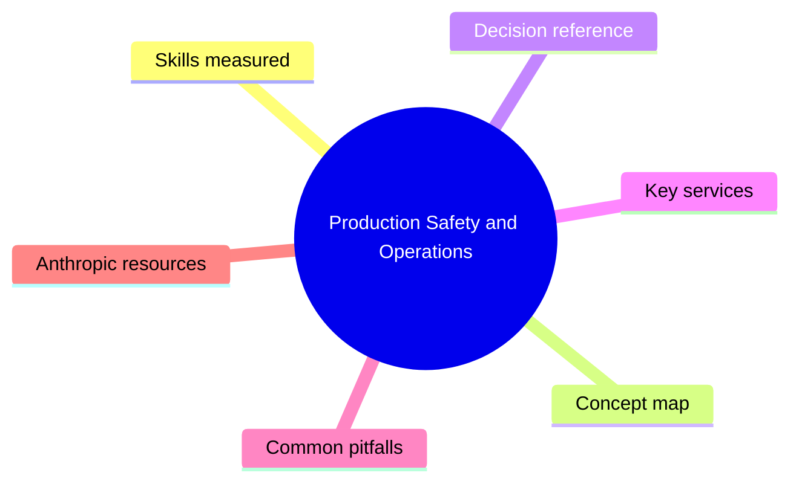
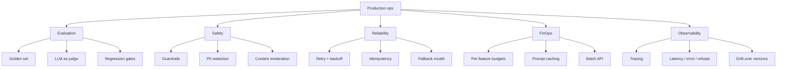

# Production Safety and Operations

> Domain 4 of CCAF. Weight: 25%.

## Domain mind map

## Skills measured

- Define an evaluation strategy: golden sets, LLM-as-judge, rubric grading.
- Mitigate jailbreaks, prompt injection, and unsafe outputs.
- Configure rate limits, retries with backoff, idempotency keys.
- Log requests and responses with PII handling and redaction.
- Track cost: per-feature, per-tenant, per-user budgets.
- Monitor latency, error rates, refusal rates, hallucination rates.
- Plan for model version pin vs. auto-upgrade; deprecation policy.
- Apply Anthropic's Usage Policy, RSP, and customer data retention rules.

## Concept map

## Decision reference

| When you see... | Pick... | Why |
|---|---|---|
| Repeated long system prompt | Prompt caching | 90% cheaper on cached tokens, 5 min TTL. |
| Async high-volume jobs, non-interactive | Message Batches API | ~50% discount, 24-hour SLA. |
| Spikes hitting rate limits | Exponential backoff + jitter | Standard cloud reliability pattern. |
| Quality regression after model upgrade | Pin to dated model snapshot | Avoid drift; upgrade on your schedule. |
| User-supplied content downstream | Inject through `<user_content>` + instruct ignore | Reduces injection blast radius. |
| Need objective quality signal | LLM-as-judge with rubric + golden labels | Cheaper than human-only eval. |

## Key services

- **Prompt caching:** mark prefix as cacheable with `cache_control`. Massive savings for stable system / context.
- **Message Batches API:** submit JSONL of requests, poll for completion.
- **Usage and cost API:** per-org analytics in Console.
- **Anthropic Trust Center:** SOC 2, GDPR, HIPAA via BAA.

## Common pitfalls

- Treating LLM-as-judge as ground truth - calibrate it against humans first.
- Logging full user prompts without PII scrubbing.
- No idempotency key on retried writes - duplicate side effects.
- Auto-tracking latest model alias in production - silently changes behavior.
- Forgetting the Batches API exists when 80% of traffic is non-interactive.

## Anthropic resources

- Prompt caching: https://docs.anthropic.com/en/docs/build-with-claude/prompt-caching
- Message Batches: https://docs.anthropic.com/en/docs/build-with-claude/batch-processing
- Evaluations: https://docs.anthropic.com/en/docs/test-and-evaluate/develop-tests
- Trust Center: https://trust.anthropic.com/
