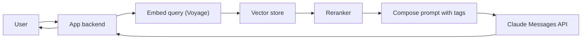
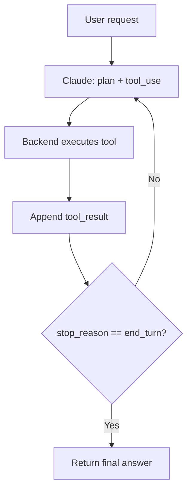
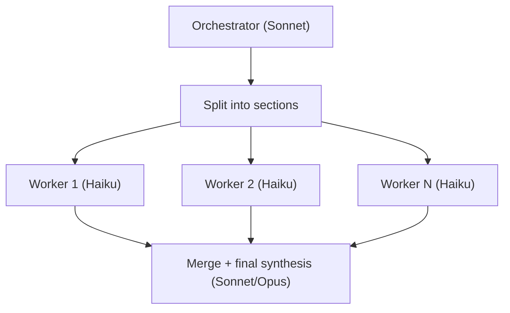
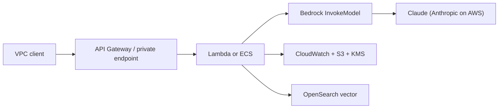

# Architectures - CCAF

> Reference architectures for typical Claude workloads.

## A. Chat with your docs (RAG)

Key choices: chunk size, overlap, embedding model, top-k, reranker, citation enforcement.

## B. Tool-using agent

Guardrails: max iterations, allow-listed tools, audit log, dry-run mode for destructive tools.

## C. Orchestrator-workers for long docs

Pattern: cheap workers fan out, premium model reassembles.

## D. Enterprise deployment on Bedrock

Controls: IAM least privilege, KMS at rest, VPC endpoints, CloudTrail, Bedrock Guardrails.
