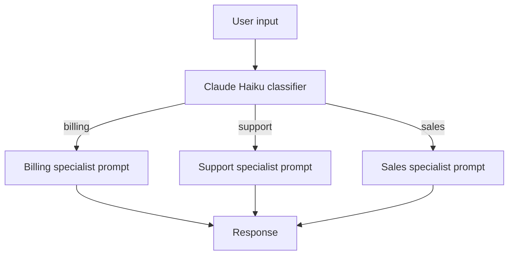
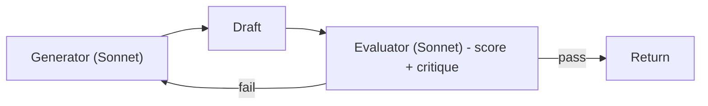
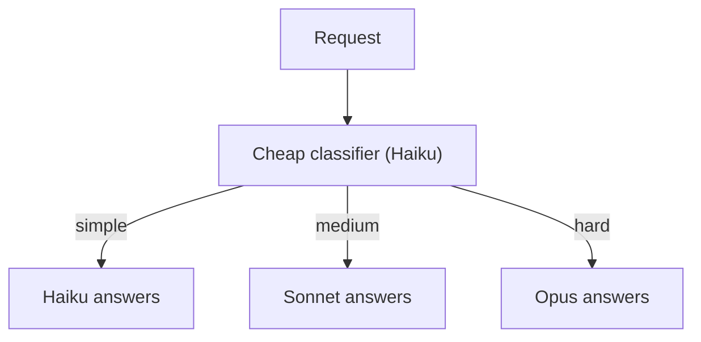

# Architecture Center

> Pattern catalogue, indexed by problem.

## I need to...

| Problem | Pattern | See |
|---|---|---|
| Answer from my private docs | RAG with citations | 09-arch-ccaf - A |
| Take actions in another system | Tool-using agent | 09-arch-ccaf - B |
| Process a huge document | Orchestrator-workers | 09-arch-ccaf - C |
| Deploy in AWS with VPC isolation | Bedrock private endpoints | 09-arch-ccaf - D |
| Triage incoming requests | Router workflow | This page |
| Improve answer quality iteratively | Evaluator-optimizer | This page |

## Router workflow

Use case: customer support inbox, multi-domain chatbots.

## Evaluator-optimizer

Use case: code generation, copywriting, structured extraction.

## Multi-model strategy

Use case: cost-control routing while keeping quality on hard tasks.
